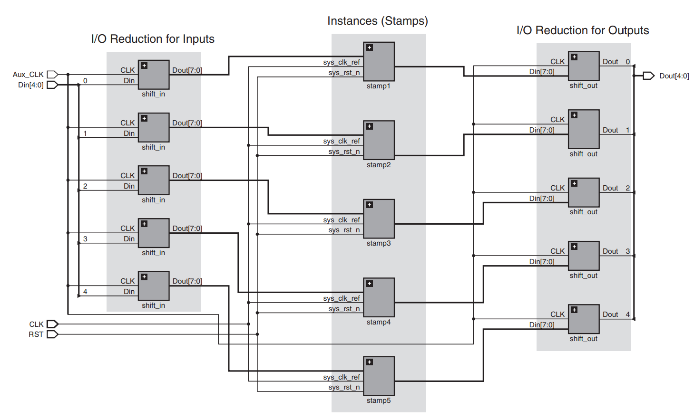

# Literature Study {#sec:litstudy}

In this chapter we explain [FPGA](acro "Field Programmable Gate Array") fundamentals, study the state-of-the-art, examine current industry methodologies for benchmarking [FPGA](acro "Field Programmable Gate Array")s and the most used provider of [IP](acro "Intellectual Property") cores used by those benchmarks. We also address the Open ESA FPGA Benchmark Suite.

## FPGA Fundamentals

Field Programmable Gate Arrays ([FPGA](acro "Field Programmable Gate Array")s) are integrated circuits based around configurable digital logic. Their configuration is loaded every time the device starts up, and can thus be reprogrammed. This is where the "Field Programmable" part of the name comes from. Historically the digital logic was an array of single purpose logic gates (hence "Gate Array") which could be interconnected. The individual gates have been replaced by Lookup Tables ([LUT](acro "LookUp Table")s) which are more flexible. [@maxfield2004design]

The main advantages of [FPGA](acro "Field Programmable Gate Array")s are their flexibility and scalability. Their unit cost is low compared to the cost of developing even a single iteration of a custom [ASCI](acro "Application-Specific Integrated Circuit") design. This makes using them attractive in virtually every scenario where the expected sale volume is less than the order of tens of millions of devices. They an also be reconfigured later, which means that some types of bugs can be fixed without having to create a new (expensive) hardware revision.

### Architecture

An [FPGA](acro "Field Programmable Gate Array") is a matrix of Configurable Logic Blocks ([CLB](acro "Configurable Logic Block")s). Every [CLB](acro "Configurable Logic Block") contains at least a [LUT](acro "LookUp Table"), a flip-flop and multiplexers to configure the inputs and outputs as illustrated by @fig:clb. The [LUT](acro "LookUp Table") is used to emulate any combinatorial logic, the flip-flop is used to combine these combinatorial elements to create sequential circuits. [@keim2018]

 design.](assets/CLB.pdf){#fig:clb height=2.5cm}

In between the [CLB](acro "Configurable Logic Block")s is a routing fabric that allows the different [CLB](acro "Configurable Logic Block")s to interconnect as illustrated by @fig:fpgafabric. There are usually other blocks in the matrix as well, such as dedicated [RAM](acro "Random-Access Memory") blocks, [DSP](acro "Digital Signal Processor") blocks (hardware multipliers with extra features like accumulators), [IO](acro "Input and Output") blocks, and high speed interfaces like [PCIe](acro "Peripheral Component Interconnect Express").

 fabric.](assets/FGPA_fabric.pdf){#fig:fpgafabric}

### Design and Programming

Programming an [FPGA](acro "Field Programmable Gate Array"), or rather, creating the configuration that is loaded into the device on startup, usually involves a computer aided design tool. The user creates a design in a Hardware Description Language ([HDL](acro "Hardware Description Language")) such as [VHDL](acro "Very High Speed Integrated Circuit HDL") or Verilog. From this design a netlist is generated. The netlist describes the connectivity of the fundamental building blocks of the [FPGA](acro "Field Programmable Gate Array"). This process is called "synthesis".

After synthesis the design must be mapped to the actual [FPGA](acro "Field Programmable Gate Array") fabric in a process called Place And Route ([PAR](acro "Place And Route")), eventually resulting in a configuration that can be programmed into the [FPGA](acro "Field Programmable Gate Array"). Before this is done, a design is normally verified with timing analysis and simulations.

Most commercially usable (that can generate netlists for actually existing hardware, not only for academical models) synthesis and [PAR](acro "Place And Route") software is proprietary and specific to the [FPGA](acro "Field Programmable Gate Array") manufacturer. Examples include Xilinx' Vivado^[https://www.xilinx.com/products/design-tools/vivado.html] and Intel Quartus Prime^[https://www.intel.com/content/www/us/en/software/programmable/quartus-prime/overview.html]. An honorable mention goes out to the [Yosys](acro "Yosys Open SYnthesis Suite")^[http://www.clifford.at/yosys/] project which created a completely open source toolchain that supports the Lattice iCE40 and most of the Xilinx 7-Series [FPGA](acro "Field Programmable Gate Array")s.

## Related work

@njuguna2008 surveys a number of benchmarks and related studies. They focus on general purpose computing or on the performance of the [FPGA](acro "Field Programmable Gate Array") toolchains. For example: the RAW Benchmark Suite [@rawMIT] focuses on "comparing reconfigurable computing systems". Many of the benchmarks also focus on a single test case and are not extendable to include others. For example: the LINPAC Benchmark [@dongarra2003linpack] tests (floating point) performance by solving systems of linear equations. The study remarks that _"Evidently, some of the benchmarks are very old relative to modern [FPGA](acro "Field Programmable Gate Array") technology."_, and by now this study itself is over 10 years old. Most of them, are not relevant for this thesis. A notable exception would seem to be OpenFPGA.org. Unfortunately OpenFPGA.org no longer exists and their website is no longer available. Not even archive.org has a copy unfortunately.

@selvaraj2013 evaluates more recent tools, but only for using FPGAs to accelerate general computation, augmenting or replacing [GPU](acro "Graphics Processing Unit")s. The discussed tools for generation of [HDL](acro "Hardware Description Language") from normal source code are interesting in the context of this thesis. This approach would allow a multitude of tests to be written in more high level languages, or have them conditionally generate the required [HDL](acro "Hardware Description Language"). Spector [@Gautier2016] is a high level synthesis benchmark based on OpenCL. They reuse/adapt part of the OpenDwarfs [@Krommydas2016] project's benchmarks, which are also focused on parallel computing.

@vansteenkiste2015 points out that there is also a significant difference between academic and commercial results. Their conclusion is that the academic state-of-the-art is (far) behind the commercial reality, especially when comparing algorithm optimizations. This is important to consider when comparing the results from this thesis to other sources, as this thesis makes use of commercial toolchains.

Comparing devices across different technology nodes (the manufacturing process) is difficult. For [MOSFET](acro "Metal-Oxide-Semiconductor Field-Effect Transistor") technology, there is a scaling law known as "Dennard scaling". It states that as the transistor technology get 30% smaller, their speed increases by about 40%. [@Dennard1975] Scaling laws allow a rough estimation of what a speed increase could be from one device to another, but care must be taken that the architectures remain comparable. Another note is that the law was written in 1975. In the more recent past, the increase in speed has slowed down. [@Bohr2007]

Titan [@murray2013titan] utilize hybrid toolchains (commercial and academic) to reach more realistic results, but they only support one vendor. Industry players such as Xilinx and Intel (previously Altera) release white papers and technical reports on their benchmark methodology and results, such as @xilinx2017, @altera2007. Their focus is on showing a competitive edge, in both hardware and software. This is an obvious conflict of interest. We do however think their methodology is worth examining, which we do in the next section.

## Stamping Methodology

Both Intel and Xilinx use the stamping methodology as described in @altera2008 as illustrated in @fig:stamping. It consists of selecting a [HDL](acro "Hardware Description Language") design (called cores or stamps) and instantiating it multiple times in the [FPGA](acro "Field Programmable Gate Array"). This can be used to test maximal speed and maximal utilization of [FPGA](acro "Field Programmable Gate Array") resources, but in reality it is more of a test of the capabilities of the design software. Since in almost all cases the use of this vendor specific design software is mandatory, it is considered part of this methodology.

Shift registers are added between the [IO](acro "Input and Output") signals of the cores and the [IO](acro "Input and Output") pins of the [FPGA](acro "Field Programmable Gate Array"). This prevents the design from being optimized away by the synthesis tools. Caution must be exercised to make sure that the [IO](acro "Input and Output") wrapping is not the critical path and does not add too much overhead. This would defeat the purpose of testing the different designs. To avoid this, the wrapping logic and cores run asynchronously on separate clocks.

{#fig:stamping}

In most published results, the [FPGA](acro "Field Programmable Gate Array") is filled to the point where the software can no longer place and route all the signals. The utilization is then measured, along with the maximal frequency. Although we think this approach may be useful to compare the efficiency of the design software, we don't think it is a good way to compare different architectures or devices. It does not provide much insight into the actual limiting factors of a device.

The design chosen as stamp is very important. A design can, due to programmer choice or pure coincidence, be more suited for one architecture or optimization algorithm over another. This is why most published benchmark results will include a set of designs. Those designs must be sourced from somewhere of which the most popular freely available source is OpenCores.

OpenCores is a website and organization which "is a community portal for professionals, amateurs, and enthusiasts interested in the field of digital design engineering. The site gives users open access to view, download, reuse, and share gateware designs. OpenCores specializes on bundles of structured files forming self-confined units, most commonly known as [IP](acro "Intellectual Property") cores, coded in [HDL](acro "Hardware Description Language")". ^[https://opencores.org/about/mission]

Both Intel and Xilinx use designs from OpenCores in their benchmarks, as well as private designs. Those private designs are often supplied by their customers and cannot be shared publicly. This makes their results of limited value since they cannot be reproduced independently. [@altera2008]

The downside of stamping is that it does not often match realistic use an [FPGA](acro "Field Programmable Gate Array"). A real design will never attempt to make use of all available resources, since the design software will most likely not be able to compute the placement and routing. Stamping does give a good rough indication for maximal usable capacity that can be compared with other devices or vendors, if the same parameters are used. It cannot be used to find the optimal use case for one device since it offers no detailed information. Another danger is that the intended use case might not align well with chosen designs.

## Open ESA FPGA Benchmark Suite

While we were implementing our already designed methodology, we found that the European Space Agency ([ESA](acro "European Space Agency")) had made an effort to create a standardized benchmark suite, not only for [ESA](acro "European Space Agency") projects but for the [FPGA](acro "Field Programmable Gate Array") industry as a whole. The project is called "Open ESA FPGA Benchmark Suite" [@mybravejourney]^[Source available online: <https://gitrepos.estec.esa.int/FPGA/open-ESA-FPGA-benchmark-suite>]. The suite is designed to enable the public sharing of configuration and benchmark data by letting anyone create additional benchmarks and publishing the results.

The currently provided benchmark circuits are a set of small circuits which address only one particular architectural feature (such as [LUT](acro "LookUp Table")s, [DSP](acro "Digital Signal Processor") blocks, memory blocks, ...) and more complex circuits which represent arithmetic functions (such as a moving average filter). Design software support is limited to [Xilinx ISE](acro "Xilinx Integrated Synthesis Environment") (deprecated since 2012) and Microsemi Libero, with upcoming support for NanoXplore's synthesis tool NanoXmap being mentioned as in progress (August 2017). Operating system support is limited to Linux. The tool is not capable of parsing the output of the design software to produce a coherent report.

While researching this software, we found that it is not user friendly. In our opinion it is too complex to use and configure. It requires 5 languages ([JSON](acro "JavaScript Object Notation"), [TCL](acro "Tool Command Language"), Python, [VHDL](acro "Very High Speed Integrated Circuit HDL"), and Bash or C-shell) and quite a bit of work to add any new device, vendor or benchmark. Some parts of the software are hardcoded to the environment of the original author, complicating the initial setup on our computer. The software flow also seems to be designed around [ISE](acro "Xilinx Integrated Synthesis Environment") with little regard given to other vendor's software. This is particularly noticeable in the use of [TCL](acro "Tool Command Language") scripts to create projects and control various bits of the synthesis process.

## Conclusion

Only the Open ESA FPGA Benchmark Suite is similar to what we have in mind with this thesis. It is unfortunate that we only discovered it after starting work on the implementation of our methodology, as it would have provided a nice starting point. It is unfinished and appears to be abandoned, no commits have been made to the code since May 2017. The experienced difficulty in setting up the software, combined with the status of our own implementation at the time we learned of its existence made us decide against using it any further.

A lot of time was spent trying to find more prior research, but this was the most relative selection of works. Various other studies do use benchmarking but they have other goals. The results of these studies cannot be used to compare various [FPGA](acro "Field Programmable Gate Array")s or multiple vendors, or are only targeted to academic toolchains.

It is our belief that this lack of relevant published prior works is due to the industrial nature of this thesis. It is a niche, closed industry. We speculate that if this kind of work is done in companies, their methodology is kept secret. Another possibility is that many choose a product family based on experience or with help from a manufacturer's data sheet. Then development can happen on the largest device in that family and when the design is (almost) finished, a more appropriately sized [FPGA](acro "Field Programmable Gate Array") is chosen. In the space industry this is rarely done given the inherent cost of swapping components. This leads to a situation where the biggest possible [FPGA](acro "Field Programmable Gate Array") is used, which benefits manufacturers, making them unlikely to try and improve this situation.
