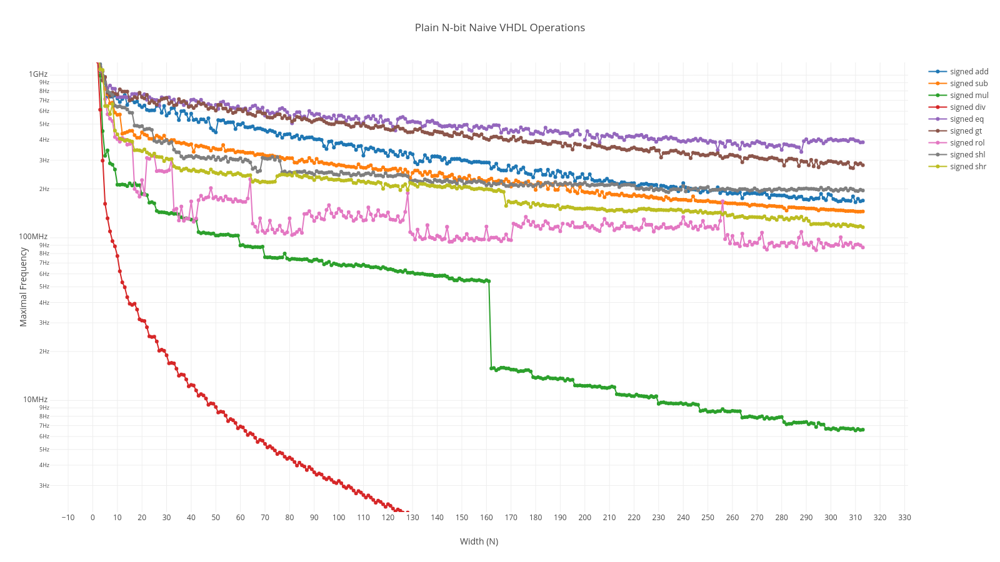

# Results {#sec:results}

In this chapter we present all results, remarks, and conclusions from the benchmarks we ran.

## Naive Mathematical Operations

This data set is the first one we created. There is no [LUT](acro "LookUp Table") utilization data. It was computationally expensive to create (it took 2 weeks of CPU power on a 10 core server) and the results are of limited value. Because of this we did not re-run it with our more up-to-date software or for the NG-MEDIUM. The entire dataset is too large to include here, it is included digitally.

### Mathematical Operator Results With Kintex-7

As stated above this data was only generated for the Kintex-7. Some data series have almost the same output, for example all signed and unsigned versions of the same operation. To make the graph readable they have been removed from @fig:maths.

{#fig:maths}

### Adder Results With NG-MEDIUM

While developing our implementation for NanoXplore, we did run a much shorter dataset with only an 8, 16, 32, 64, 128, and 256 bit adder. The data only includes the maximum clock speed because the LUT utilization is so low it does not provide any useful information. Results in @fig:add and @tbl:add.

We did not expect the NG-MEDIUM to overtake the Kintex-7, and are also surprised that the NG-MEDIUM has a relatively flat curve for the first four results. The Kintex-7's curve does conform to the shape we where expecting: gradually sloping downwards, with the maximal clock roughly halving per doubling of the input size. This is what could be expected from an optimized, but not pipelined, adder design in hardware.

|Name      | Kintex-7 F~Max~ [MHz] | NG-MEDIUM F~Max~ [MHz] |
|----------|-------------:|-------------:|
|add8      |     737.4631 |     590.6670 |
|add16     |     738.0074 |     585.4800 |
|add32     |     626.9592 |     554.6310 |
|add64     |     480.7692 |     542.8880 |
|add128    |     326.0515 |     304.7850 |
|add256    |     194.9318 |     313.2830 |

 : The results for the simple adder benchmarks. {#tbl:add}

{#fig:add}

\clearpage
## ISCAS'89

@Tbl:iscas and @fig:iscas show the output data of the ISCAS benchmarks. The order of the table and graphs is the same. With this data we can select a pattern to use as background filler for the "FIR Filter With Filler" benchmark set. We chose `s832` (row highlighted in orange) because it still performs above 240MHz (the maximum speed of the FIR filter) and because its [LUT](acro "LookUp Table") utilization rate is 0.1%. This makes it easy to use multiples of 10 and get a good approximations of what the total [LUT](acro "LookUp Table") utilization rate would be.

The two lines highlighted in yellow `s641` and `s713` are twice as fast on the NG-MEDIUM as the Kintex-7. This is very surprising given the NG-MEDIUM's inherent disadvantage due to the difference in the technology node. Dennard's scaling law roughly predicts a 2x advantage for the Kintex-7.

We speculate that, given that the ISCAS benchmarks all consist of single or dual input gates, it is possible that the design can be placed more efficiently on the NG-MEDIUM with it's 4 inputs [LUT](acro "LookUp Table")s versue the Kintex-7 with it's 6 input [LUT](acro "LookUp Table")s. We think that this means that, when optimizing for speed, the synthesis tool will place more gates in a single [LUT](acro "LookUp Table"). This would mean that the "output" in between some of those packed gates cannot be used to feed another [LUT](acro "LookUp Table"), so those gates will end up in more than one [LUT](acro "LookUp Table").

The results for the NG-MEDIUM from `s5378` onwards (except `s35932`) are bizarre, because they seem to be missing some flip-flops if we compare the numbers found in the output data with the ISCAS'89 specifications from @tbl:iscascircuits. We don't know where this discrepancy comes from. Analyzing the logged output information from our run script offered no explanation.

Generating this entire dataset takes about 20 minutes on a modern 20 core server.

\clearpage
\hypertarget{tbl:iscas}{}
\begin{longtable}[]{l|rrrr|rrrr}
\caption{\label{tbl:iscas}The results of the ISCAS benchmarks.}\tabularnewline
\toprule
 & \multicolumn{4}{c|}{Kintex-7} & \multicolumn{4}{c}{NG-MEDIUM} \tabularnewline
 Name & F~Max~ [MHz] & LUTs & FFs & LUT \% & F~Max~ [MHz] & LUTs & FFs & LUT \%\tabularnewline
\midrule
\endfirsthead
\toprule
 & \multicolumn{4}{c|}{Kintex-7} & \multicolumn{4}{c}{NG-MEDIUM} \tabularnewline
 Name & F~Max~ [MHz] & LUTs & FFs & LUT & F~Max~ [MHz] & LUTs & FFs & LUT\tabularnewline
\midrule
\endhead
 s27    & 564.6527 &     9 &    3 & 0.0035 & 362.8450 &    5 &    3 & 0.0146 \\
 s27a   & 564.6527 &     9 &    3 & 0.0035 & 362.8450 &    5 &    3 & 0.0146 \\
 s208   & 320.5128 &    81 &    8 & 0.0319 & 255.4280 &   23 &    8 & 0.0671 \\
 s298   & 325.6268 &   109 &   14 & 0.0429 & 254.7120 &   28 &   14 & 0.0817 \\
 s344   & 193.3488 &   146 &   15 & 0.0574 & 197.5110 &   43 &   15 & 0.1255 \\
 s349   & 196.7342 &   144 &   15 & 0.0566 & 197.5110 &   43 &   15 & 0.1255 \\
 s382   & 314.6633 &   146 &   21 & 0.0574 & 194.8180 &   45 &   21 & 0.1313 \\
 s386   & 281.9284 &   152 &    6 & 0.0598 & 254.1940 &   39 &    6 & 0.1138 \\
 s386a  & 281.9284 &   152 &    6 & 0.0598 & 254.1940 &   39 &    6 & 0.1138 \\
 s400   & 342.1143 &   154 &   21 & 0.0606 & 204.4990 &   45 &   21 & 0.1313 \\
 s420   & 289.1845 &   180 &   16 & 0.0708 & 248.8800 &   44 &   16 & 0.1284 \\
 s444   & 289.6032 &   169 &   21 & 0.0665 & 201.8980 &   46 &   21 & 0.1342 \\
 s510   & 279.4077 &   187 &    6 & 0.0736 & 195.1600 &   81 &    6 & 0.2363 \\
 s526   & 329.3808 &   178 &   21 & 0.0700 & 201.1670 &   40 &   21 & 0.1167 \\
 s526a  & 345.5425 &   178 &   21 & 0.0700 & 201.1670 &   40 &   21 & 0.1167 \\
 \rowcolor{Goldenrod}
 s641   &  52.9577 &   334 &   19 & 0.1314 & 111.0250 &   67 &   19 & 0.1955 \\
 \rowcolor{Goldenrod}
 s713   &  54.1126 &   355 &   19 & 0.1397 & 111.7190 &   67 &   19 & 0.1955 \\
 s820   & 300.0300 &   272 &    5 & 0.1070 & 165.6730 &   87 &    5 & 0.2539 \\
 \rowcolor{Apricot}
 s832   & 287.5216 &   269 &    5 & 0.1058 & 163.6930 &   87 &    5 & 0.2539 \\
 s838   & 282.7255 &   322 &   32 & 0.1267 & 253.7430 &   86 &   32 & 0.2509 \\
 s953   & 178.4758 &   298 &   29 & 0.1172 & 166.6110 &  134 &   29 & 0.3910 \\
 s1196  & 236.6864 &   440 &   18 & 0.1731 & 126.3260 &  149 &   18 & 0.4348 \\
 s1196a & 236.6864 &   440 &   18 & 0.1731 & 126.3260 &  149 &   18 & 0.4348 \\
 s1196b & 236.6864 &   440 &   18 & 0.1731 & 126.3260 &  149 &   18 & 0.4348 \\
 s1238  & 237.3042 &   379 &   18 & 0.1491 & 141.4030 &  157 &   18 & 0.4581 \\
 s1238a & 237.3042 &   379 &   18 & 0.1491 & 141.4030 &  157 &   18 & 0.4581 \\
 s1423  &  59.5203 &   538 &   74 & 0.2116 &  54.0570 &  169 &   74 & 0.4931 \\
 s1488  & 178.6033 &   543 &    6 & 0.2136 & 162.8660 &  191 &    6 & 0.5573 \\
 s1494  & 184.3998 &   526 &    6 & 0.2069 & 158.7050 &  194 &    6 & 0.5661 \\
 s5378  & 126.1511 &  2199 &  179 & 0.8651 & 101.0100 &  405 &  161 & 1.1817 \\
 s9234  &  50.1655 &  4256 &  211 & 1.6743 &  78.4810 &  276 &  133 & 0.8053 \\
 s13207 &  50.4414 &  5807 &  638 & 2.2844 &  67.0380 &  586 &  475 & 1.7099 \\
 s15850 &  46.8121 &  6915 &  534 & 2.7203 &  47.5870 &  866 &  457 & 2.5268 \\
 s35932 &  70.1066 & 12265 & 1728 & 4.8249 & 141.2430 & 2626 & 1728 & 7.6622 \\
 s38417 &  65.6642 & 14698 & 1636 & 5.7821 &  54.5200 & 2726 & 1538 & 7.9540 \\
 s38584 &  55.8534 & 13086 & 1426 & 5.1479 &  68.5260 & 3362 & 1384 & 9.8098 \\
\bottomrule
\end{longtable}

{#fig:iscas}

\clearpage
## FIR Filter With Filler

The results below are all for the Kintex-7. The entire dataset is too large to include here, it is included digitally. Unfortunately we could not complete this benchmark set for the NG-MEDIUM due to the instability of the synthesis software. Due to the timing of when we ran the tests we did not have time to try more configurations.

@Fig:fir shows a "clock speed" versus "device fill rate" graph. This one graph could be considered the summary of the benchmark data. These are our observations from this graph:

1. There is a region where the routing resources are not limiting the performances (below 50% of utilization). The independent FIR filters consistently hit the 220 MHz region. This performance is reachable for limited parts of a design, with the right design attention.

2. As the primary design has to make room for the filler, a second performance plateau is gradually reached at around 170 MHz and 80% utilization rate. These two plateaus, if proven sufficiently invariant, could make their way into a component database as assumptions for early performance estimations. The second point would be the default performance statistic for this device.

The usage limit was set to 90%, so no attempts were made to synthesize a combination of parameters if its utilization exceeded that. Generating this entire dataset takes a few days on a modern 20 core server. This is mostly due to that usage limit. The time it takes for one data point increases dramatically with fill rate. [Appendix @sec:firextragraphs] has some graphs on that show in more detail which data points were generated.

{#fig:fir}
